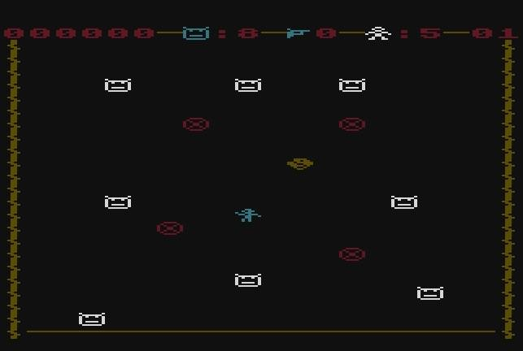
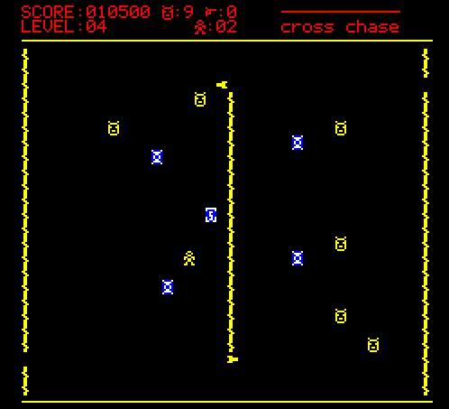
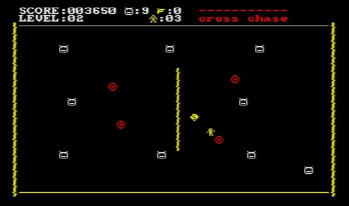
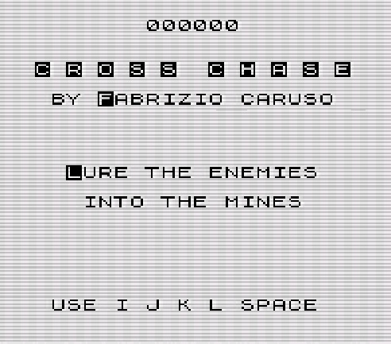

# CROSS CHASE
CROSS CHASE

by Fabrizio Caruso (Fabrizio_Caruso@hotmail.com)

This is a personal project whose goal is to create a fun playable game that should run
on 8 bit computers and consoles using 6502-compatible and Z80-compatible CPUs.

The program is written in ANSI C and currently compiled with 
- CC65 for all 6502 targets (http://www.cc65.org/), 
- SCCZ80 (from Z88DK) for most Z80 targets (https://www.z88dk.org/), 
- ZSDCC (from Z88DK) for some Z80 targets (https://www.z88dk.org/),
- CMOC for most 6809 targets (https://perso.b2b2c.ca/~sarrazip/dev/cmoc.html),
- WinCMOC for some 6809 targets (https://sourceforge.net/projects/cmoc-win32/).

For other targets, GCC6809 for other 6809 targets, sdcc (proper or its CPCTelera version), as well as "GCC for TI" for the Texas TI99/4a are being taken into consideration. 

The game should be as portable as possible.
Therefore the following coding choices and design rules are applied:
1. ANSI C (for the game logic);
2.sStrictly separated input/output and hardware-dependent code from the game logic;
3. the prefered default graphics and input implementation is provided by conio.h (as implemented in CC65, Z88DK and WinCMOC), whenever no specialized code for a specific target is implemented;
4. joystick-related libraries as found in CC65 and in Z88DK;

Some target(s) may get specific graphic code with re-defined characters, software/hardware sprites and music/sound effects.

As a consequence of the design, the code includes a framework that could be used to develop other massively multi-system games and programs. 

LICENSE

This software is provided 'as-is', without any express or implied warranty.
In no event will the authors be held liable for any damages arising from
the use of this software.

Permission is granted to anyone to use this software for non-commercial applications, 
subject to the following restrictions:

1. The origin of this software must not be misrepresented; you must not
claim that you wrote the original software. If you use this software in
a product, an acknowledgment in the product documentation would be
appreciated but is not required.

2. Altered source versions must be plainly marked as such, and must not
be misrepresented as being the original software.

3. This notice may not be removed or altered from any source distribution.
