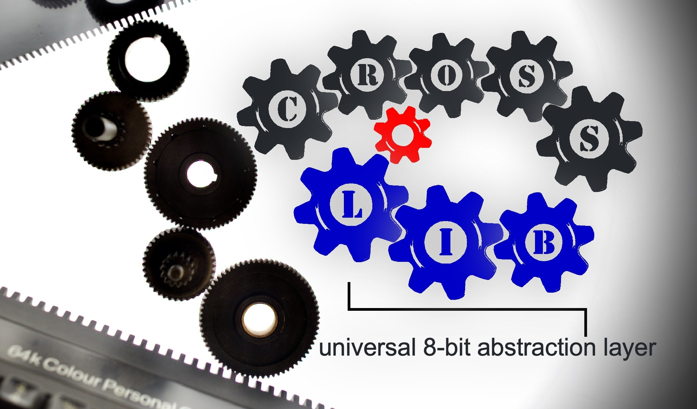
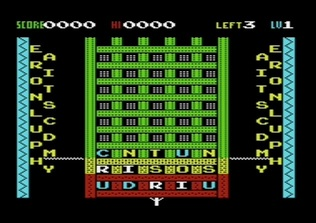
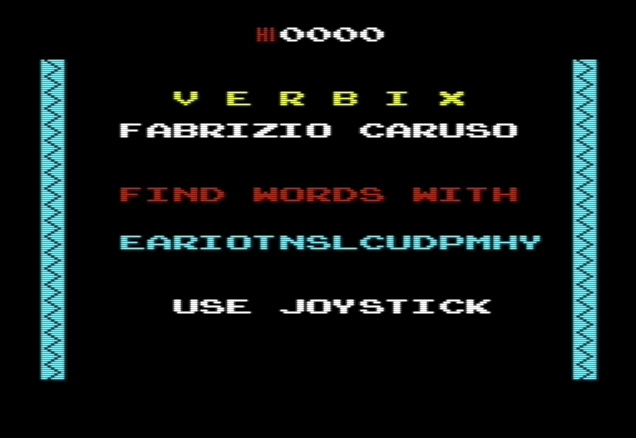
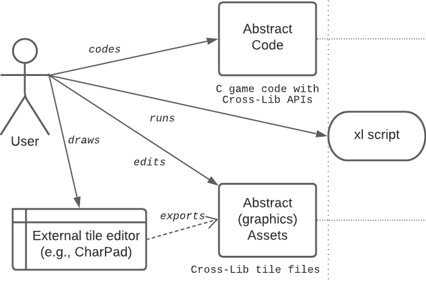
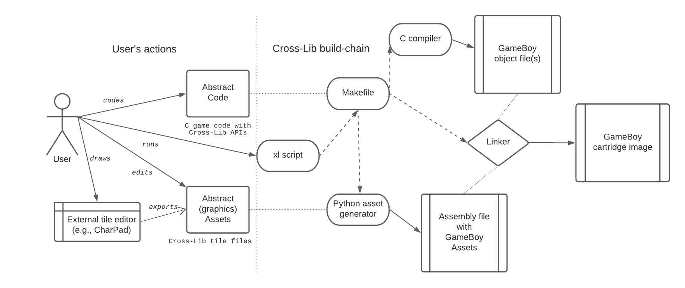

# CROSS LIB


*Cross-Lib* and games that use it (e.g., Chase, Shoot, Bomber, Snake, Horde, Verbix, Shuriken, Stinger, Trex)

by Fabrizio Caruso (fabrizio_caruso@hotmail.com)

The universal *retro-hardware abstraction layer*: Use the **very same code** for about 200 vintage computers, consoles, calculators and other devices.

Read the <a href="https://github.com/Fabrizio-Caruso/CROSS-LIB/blob/master/docs/DISCLAIMER.md"><b>Disclaimer.</b></a>

<br />

The logo was designed by *Hamlet*.




-------------------------------------------

## THE GOAL

*Cross-Lib* is a *retro-hardware abstraction layer* for coding "universal" games with **the very same code** for hundreds of mostly 8-bit systems (consoles, computers, scientific calculators, hand-held consoles, arcade boards, hacked toy computers, etc.).

*Cross-Lib* is a *WORA* (Write Once Run Anywhere) framework for vintage systems, i.e., you code a game **once** in an abstract hardware-agnostic way and *Cross-Lib* produces the very same game for about 200 vintage systems.

-------------------------------------------

## ARTICLE ABOUT CROSS-LIB
Article in English (updated and modified version of an article published in C.A.L.L. Apple Volume 3 Number 1 (January 2023):
https://github.com/Fabrizio-Caruso/CROSS-LIB/blob/master/docs/EnglishArticle.md

Article in French (first published in the French magazine "Programmez! Hors série #6") that describes Cross-Lib in details.
https://github.com/Fabrizio-Caruso/CROSS-LIB/blob/master/docs/articles/CROSS_LIB_PUBLIC.pdf

-------------------------------------------


## THE GAMES

These games are the proof of the flexibility of *Cross-Lib*.

Play the games online:

https://github.com/Fabrizio-Caruso/CROSS-LIB/blob/master/docs/GAMES.md

1. <a href="https://github.com/Fabrizio-Caruso/CROSS-LIB/blob/master/docs/GAMES.md#trex"><b>Trex</b></a> is a mini-game and an obvious clone of off-line Chrome T-Rex game.
2. <a href="https://github.com/Fabrizio-Caruso/CROSS-LIB/blob/master/docs/GAMES.md#stinger"><b>Stinger</b></a> is a tank-shooter with several enemies, levels, power-ups and items to pick.
3. <a href="https://github.com/Fabrizio-Caruso/CROSS-LIB/blob/master/docs/GAMES.md#shuriken"><b>Shuriken</b></a> is somehow inspired by Pac-man and Pengo.
4. <a href="https://github.com/Fabrizio-Caruso/CROSS-LIB/blob/master/docs/GAMES.md#verbix"><b>Verbix</b></a> is a Scrabble-like game that looks like Tetrix with letters.
5. <a href="https://github.com/Fabrizio-Caruso/CROSS-LIB/blob/master/docs/GAMES.md#horde"><b>Horde</b></a> is a zombie shooter with several different enemies, levels, power-ups and special items to pick.
6. <a href="https://github.com/Fabrizio-Caruso/CROSS-LIB/blob/master/docs/GAMES.md#snake"><b>Snake</b></a> is my personal re-interpretation of Nibbler (arcade game) to which I have added more game elements
7. <a href="https://github.com/Fabrizio-Caruso/CROSS-LIB/blob/master/docs/GAMES.md#bomber"><b>Bomber</b></a> is a mini-game and clone of Air Attack (aka Blitz).
8. <a href="https://github.com/Fabrizio-Caruso/CROSS-LIB/blob/master/docs/GAMES.md#shoot"><b>Shoot</b></a> is a shooter somehow similar to Robotron. It has many items and secrets to discover.
9. <a href="https://github.com/Fabrizio-Caruso/CROSS-LIB/blob/master/docs/GAMES.md#chase"><b>Chase</b></a> is somehow similar to *Gnome Robots* but in real-time game and with several items and power-ups.

-------------------------------------------


## CURRENTLY SUPPORTED SYSTEMS AND ARCHITECTURES

Cross-Lib can be used to build games for about 200 different vintage systems (computers, consoles, hand-helds, arcade boards, scientific pocket calculators, etc.). 
A partial list of the supported systems with their status is in: 

https://github.com/Fabrizio-Caruso/CROSS-LIB/blob/master/docs/STATUS.md

The most significant supported vintage CPU architectures are:

- COSMAC RCA 1802 
- Intel 8080 
- MOS 6502 
- Motorola 6803 
- Motorola 6809
- TMS 9900
- Zilog 80 

Cross-Lib has also some experimental support for vintage 16-bit and 32-bit systems and for the native PC console.

For a more complete list of architectures you can look at:

https://github.com/Fabrizio-Caruso/CROSS-LIB/blob/master/docs/ARCHITECTURES.md

-------------------------------------------

## THE TOOL-CHAIN

Cross-Lib provides a full tool-chain to build universal vintage 8-bit games. 

### Cross-Lib components

Cross-Lib provides:
- a library with hardware-agnostic APIs for game development;
- scripts that convert automatically compiler-agnostic graphics assets to target-specific graphics assets formats;
- makefiles that handle the build process;
- the "user-friendly" script `xl` to manage game projects (see the subsequent sections below).


### The build process

When a game is built for a specific target, the Cross-Lib tool-chain will automatically:
1. if needed, convert the abstract graphics assets in graphics assets for the given target on the fly;
2. compile the game code (and the target-specific game assets) by using the appropriate compiler;
3. if needed, whenever possible, create a disk/cassette/cartridge image.

In most cases the user will just have to
- code in C a game that uses Cross-Lib APIs;
- draw the graphics assets;
- run the `xl` script to create, build and test the game.



The `xl` script will trigger the full build process which will produce the target specific version of the project 
or massively build the same project for several targets (or even build several projects for one or more targets).
For example for the build of a project for the sole GameBoy target we may represent 
the interactions of various Cross-Lib components with this diagram:




### The compilers

Code written in C with Cross-Lib can be compiled by several different cross-compilers and natively on the PC.

The tool-chain currently supports: `CC65`, `Z88DK` (`SCCZ80` and `ZSDCC`), `CMOC`, `LCC1802`, `ACK`, `XTC68`, `GCC`, `GCC-Z8K`, `GCC-ATARI-ST`, `GCC-AMIGA`, `GCC-TI`, `VBCC`, `CC6303`.
For more details on the supported compilers we refer to:

https://github.com/Fabrizio-Caruso/CROSS-LIB/blob/master/docs/COMPILERS.md

Thanks to Alex Thissen, a version of Cross-Lib with (Z88DK, CC65, CMOC and native compilers) is available as a Docker image (to be built by using the provided Dockerfile) with a devcontainer configuration.

-------------------------------------------

## NO LOCAL INSTALLATION

Having a Dockerfile and a devcontainer configuration means that anyone with a GitHub account can just clone this repository and run it with GitHub CodeSpaces (free of charge with some restrictions): https://github.com/codespaces.

-------------------------------------------
## LOCAL DOCKER

The dockerized version of Cross-Lib can used by 
- by cloning this repository into a directory (let us refer to it as `<local_cross-lib>`);
- by building the docker image that contains the dependencies with 

```docker build . -t crosslib:<version>```;

- by running the docker container and mapping the cloned repository into a directory (e.g. `/workspaces/crosslib`) in the container with

```docker run -it -v <local_cross-lib>:/workspaces/crosslib --env-file <local_cross-lib>/.devcontainer/devcontainer.env crosslib:<version> bash```
- (once in the docker container) by entering `workspaces/crosslib/src` and running `xl` commands.

-------------------------------------------

## LOCAL NON-DOCKER INSTALLATION - PREREQUISITES

Cross-Lib is meant to be used under a POSIX environment (Windows+Cygwin, Linux, etc.).

In order to be able to build the games and tests on all `default targets` you need:
- GNU `make`
- `python` (2.x or 3.x)
- `gcc` and `ncurses` (necessary only for native builds)
- cross-compilers (necessary to build for vintage targets)
- `java` only to build disk images for the Apple//e and Apple\]\[ targets 

For the compilers to work, you may need to add the location of their binaries to the `$PATH` environment variable and to add the execution rights to those binaries.
If the compiler's binary cannot be found, you may have to set their paths in: `src\makefiles.common\auxiliary/Makefile_compilers`, e.g., `Z88DK_PATH`, `LCC1802_PATH`, etc..

For more details on the prerequisites we refer to: 

https://github.com/Fabrizio-Caruso/CROSS-LIB/blob/master/docs/PREREQUISITES.md


-------------------------------------------
## LOCAL NON-DOCKER INSTALLATION OF THE TOOL-CHAIN

The tool-chain Cross-Lib can be installed on different POSIX-compliant environments.
It has been tested on:
- Windows (7, 10) + `Cygwin`
- Linux Ubuntu 18.04 under the Windows Subsystem
- Linux (KUbuntu 18.04, Lubuntu 21.10) 
- FreeBSD 13.0

Cross-Lib itself does not require any installation. It is just a source library and scripts that is ready to use as is, by just downloading or cloning the content of this repository.
For example you can do it by:

```
git clone https://github.com/Fabrizio-Caruso/CROSS-LIB.git
```

In order to use Cross-Lib you will need to install the prerequisites described in the previous section. 
The way these prerequisites are installed vary depending on the environment.

### Under Windows + Cygwin
For Windows + Cygwin the tested and verified installation procedure uses:
- `Cygwin` setup to install `gcc`, `make`, `python`, `java`
- `CC65` is installed under Windows by just downloading and decompressing its snapshot (https://sourceforge.net/projects/cc65/).
- `Z88DK` is installed under Windows by downloading and decompressing its latest nightly build (http://nightly.z88dk.org/).
- `CMOC` and `ACK` are installed from sources. Look at the installation procedure under Linux for the details.
- `LCC1802` is installed under Windows by simply decompressing its released binary version (https://github.com/bill2009/lcc1802/releases).

### Under Linux
For Linux (native or under the Windows Subsystem), the tested and verified procedure both standard repositories and installation from sources.

A detailed procedure for recent Ubuntu distributions is described here: 

https://github.com/Fabrizio-Caruso/CROSS-LIB/blob/master/docs/LINUX_SETUP.md

-------------------------------------------

## HOW TO START

Inside the project main directory, you find the `src` and the `build` directories:
- `src` contains the source code and all other files that are necessary to build the games and tests
- `build` is supposed to be empty at first and it is the target directory for the build process.

First of all you need to be in the `src` directory.
From `src` you can use the `xl` script (or the `make` command) to do different operations on projects.

For a description of the `xl` script and its parameters, take a look at the next sections.

-------------------------------------------

## THE `xl` SCRIPT

The script `xl` is found inside the `src` directory and it is meant to be used from `src`.
Make sure that it has execution rights (`chmod +x ./xl`) and, for your convenience, that the current directory `.` is included in `$PATH`.
Its name stands obviously for `Cross-Lib` as it can execute most of the operations people may want to do with Cross-Lib.
It can be used to create, build, delete and perform other operations on all Cross-Lib projects (tests, built-in games and custom games). 

`xl` is used as follows:
```
xl <command> <[optional] parameters>
```

You can display its instructions and some examples by using:
```
xl help <[optional] command>
```
where commands are `build`, `clean`, `create`,`delete`, `list`, `help`, `reset`.

The following sections will show how to use this script in the my common use-cases.

-------------------------------------------
## BUILDING PROJECTS

We recommend to use `xl build` to build projects. Alternatively you can use `make`.

### Using `xl build` (recommended)

I recommend that you use `xl build`:

`xl build [game_or_test_name] [optional system_name] [optional number of threads]`

A convenient shortcut is using just `xl` as follows:

`xl [project_name] [optional system_name] [optional number of threads]`

The `[optional system_name]` parameter is the name of the target. If no target is specified then the native target (the host terminal) is implied.

The `[optional number of threads]` is used to specify the number of threads to use for multiple targets that can be built in parallel.

Examples:
- `xl build snake` -> It builds Cross Snake for the native console by using `gcc` and `ncurses`.
- `xl build bomber atari` -> It builds Cross Bomber for the Atari 8-bit target (by using the appropriate cross-compiler, i.e., CC65)
- `xl build snake vic20` -> It builds Cross Snake for the Commodore Vic 20.
- `xl build games msx` -> It builds all game projects for the MSX target (by using the appropriate cross-compiler, i.e., the ones in Z88DK).
- `xl build bomber cc65_targets` -> It builds Cross Bomber for all targets that use CC65.
- `xl build tests c64` -> It builds all tests for the Commodore 64 target

Remark: All binaries will be in the `build` directory (same depth level as `src`).

### Using `make` (NOT recommended)

Using a standard `make` command is possible but you will get fewer options.

For game projects you can use:

`make [system_name] -f ./games/[game_name]/Makefile.[game_name]`

For test projects you can use:

`make [system_name] -f ./tests/[test_name]/Makefile.[test_name]`

For more details and examples on build instructions for both `xl build` and `make` we refer to:

https://github.com/Fabrizio-Caruso/CROSS-LIB/blob/master/docs/BUILD.md

-------------------------------------------
## CREATING A NEW GAME PROJECT

In order to create a new game project we can use the `xl create` scripts that will create the necessary initial source code files, graphic assets and Makefile inside a folder in the `games` folder.

The script is used as follows:

`xl create [game project name] [initial code type]`

where `[initial code type]` can be 
- `helloworld` or empty for initial code that only displays 'hello world'
- `game` for an initial code for a standard game with a main loop and a level loop
- `apis` for an initial code that uses most APIs.

Examples:
- `xl create foo` -> It creates a new game project `foo` with a trivial code that initializes sound, input and graphics and just displays `hello world` on the screen.
- `xl create bar game` -> It creates a new game project `bar` with code that initializes sound, input and graphics and contains the main loops that may be used in a standard game.
- `xl create foobar apis` -> It creates a new game project `foobar` with code that initializes sound, input and graphics and contains code that shows how to use most APIs.


-------------------------------------------
## RESETTING A PROJECT BUILD

In order to remove generated graphics assets of a specific project and other temporary files that are produced during a build, you can use `xl reset`.
Use this command if you want to regenerate the graphics assets of a specific project.

`xl reset [project name]`

Project-specific graphics assets and temporary files including project-specific ones are removed.
Built binaries are preserved.

Example:
- `xl reset foo` -> It deletes generated graphics assets and temporary files for `foo`.

-------------------------------------------
## CLEANING TEMPORARY FILES AND BINARIES

If you  want to remove built binaries and temporary files that are produced during a build you can use 'xl clean'.

`xl clean [optional project name]`

If you provide a project name, then also project-specific temporary files are removed including generated project-specific graphics assets.

Examples:
- `xl clean` -> It deletes all built binaries and some generic temporary files (not the once inside project directories).
- `xl clean foo` -> It deletes the same files as `xl clean` and also deletes temporary files found inside the `foo` folder.

-------------------------------------------
## LISTING PROJECTS

You can list all current game and test projects with 

`xl list`

which searches both `tests` and `games` folders for projects (both built-in and user-defined) and produces a list with all of them.

--------------------------------------------
## DELETING PROJECTS

Non-built-in game projects can be deleted trhough the `xl delete` script in a very simple way:

`xl delete [game project name]`

Example: 

`xl delete foo` -> It removes the `foo` source code, assets and Makefile files


-------------------------------------------

## HARDWARE-AGNOSTIC CODE

Thanks to Cross-Lib APIs, the game code can be *hardware-agnostic*.
Using only Cross-Lib APIs is not enough, though, as Cross-Lib covers targets that have different screen size, screen shape and targets that lack some hardware features such as graphics, colors, sounds.

### ANSI C (A sub-set of)
The code has to be compiled by several different compilers that do not necessarily support the latest version of the C standard.
Therefore it should be written in a sub-set of ANSI C89 that is common among all supported compilers.

This sub-set can be described as (mostly) ANSI C89 without:
- `float` types;
- `struct` copies, assignments, parameters (use pointers to `struct` instead);
- dynamically allocated memory (`malloc`, `free`).

Moreover for performance reasons it is better to avoid recursion (as this has an extreme high cost on MOS 6502 targets).

Some C99 features are available:
- Modern `//` comments are allowed.
- `stdint.h` is not available but `uint8_t` and `uint16_t` are (with no need for extra include directive). 


### Screen size
Using Cross-Lib APIs is not enough as the screen size and shape may be different.
Cross-Lib exposes a constant `XSize` for the width of the screen and a constant `YSize` for the height of the screen.
Both these macros are measured in terms of numbers of *tiles* (see next section).
The game code should rely on fractions of `XSize` and of `YSize` and never use hard-coded sizes or use conditional directives to cover all sizes.
By doing so, upon compilation, the game will auto-adapt to the target's screen size.


### Tile-based Graphics

Graphics in Cross-Lib is tile-based as this is the only possible graphics that can be supported by all targets. 
For targets with graphics, the shapes of tiles are only defined at compilation time and cannot be re-defined.
So, for targets with graphics, smoothly moving sprites can only be implemented as software sprites through pre-shifted tiles.

Most targets with graphics have 8x8 pixel tiles but some other targets with graphics have different shapes.
So do not implement logic that only assumes 8x8 pixel tiles (e.g. when implementing software sprites with pre-shifted tiles). 
If you want to support targets with no graphics (i.e., tiles are just mapped to ASCII characters), 
you either avoid code that depends on tile shapes or if you, you have to implement an alternative version for non-graphics targets.

For example for the game Cross Snake you can see how it is rendered on the MSX 1 (graphics, sounds, colors) and on the Game Boy (graphics, sounds but no colors):


For more snapshots we refer to: 

https://github.com/Fabrizio-Caruso/CROSS-LIB/blob/master/docs/SNAPSHOTS.md


### Colors, Sounds and Graphics
Some targets have no colors or no color on text, or no sounds, or no graphics.
So do not write any logic that relies only on the presence of colors/sounds/graphics; or if you do, use conditional directives to implement an alternative logic for targets with no colors/sounds/graphics.


### Learn from the built-in games and tests
Cross-Lib comes with games and tests whose code can be used to learn how to code universal games.

The code of the games is in:

https://github.com/Fabrizio-Caruso/CROSS-LIB/tree/master/src/games

The code of the examples is in:

https://github.com/Fabrizio-Caruso/CROSS-LIB/tree/master/src/examples


-------------------------------------------
## CROSS-LIB APIs

Cross-Lib provides several APIs that allow to code games in a hardware-agnostic way for all supported targets.
The currently available APIs are described at

https://github.com/Fabrizio-Caruso/CROSS-LIB/blob/master/docs/CROSS_LIB_APIS.md


-------------------------------------------

## LOADING THE GAMES
In order to run the game you will have to follow a different procedure depending on whether you want to load it into an emulated system or a real system.

### Loading the game into an emulated vintage system
In most cases loading an executable into an emulator is straightforward. 
For a detailed guide on how to load the game on several emulated systems for which the procedure is not obvious, we refer to: 

https://github.com/Fabrizio-Caruso/CROSS-LIB/blob/master/docs/HOW_TO_LOAD_THE_GAME.md

### Loading the game into a real vintage system
This depends on the systems and the format used to store the game. For some hints on this take a look at:

https://github.com/Fabrizio-Caruso/CROSS-LIB/blob/master/docs/HOW_TO_LOAD_THE_GAME_ON_REAL_HARDWARE.md


-------------------------------------------


## THE FUTURE

The main future goals are
- improving the exposed APIs 
- supporting more cross-compilers, native compilers, systems and sub-targets
- adding more features to Cross-Lib (e.g., more redefinable tiles, more sound effects, etc.)
- coding more universal games and demos


-------------------------------------------

## ACKNOWLEDGEMENTS

Cross-Lib would not exist without the cross-compilers and the support of their developers and the support of some people who have helped me handle the input/output of some targets.

A partial list of the people who have helped in found in: https://github.com/Fabrizio-Caruso/CROSS-LIB/blob/master/docs/CREDITS.txt

-------------------------------------------

## LICENCE

This software is provided 'as-is', without any express or implied warranty.
In no event will the authors be held liable for any damages arising from
the use of this software.

Permission is granted to anyone to use this software for non-commercial applications, 
subject to the following restrictions:

1. The origin of this software must not be misrepresented; you must not
claim that you wrote the original software. If you use this software in
a product, an acknowledgment in the product documentation would be
appreciated but is not required.

2. Altered source versions must be plainly marked as such, and must not
be misrepresented as being the original software.

3. This notice may not be removed or altered from any source distribution.

For example I do not authorize selling hardware, software, firmware or any other product that contains any part of Cross-Lib and/or its games (e.g., pre-loaded disks, tapes, cartridges, etc.).
On the other hand I authorize people to load the games in the most convenient way for their personal use.

