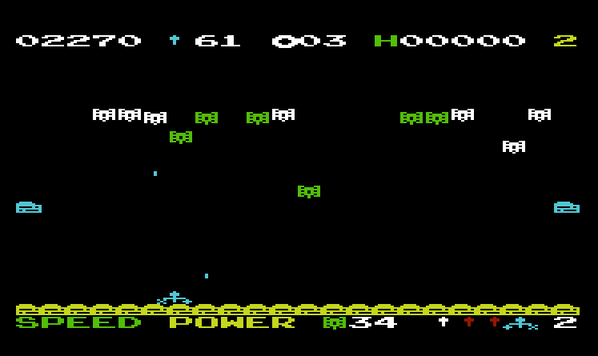
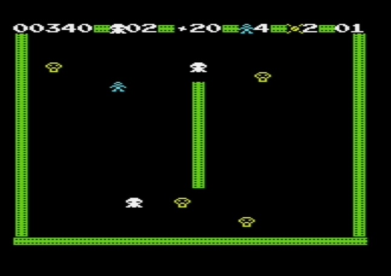
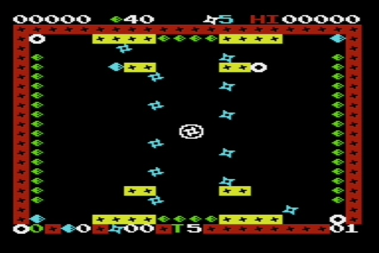

# CROSS LIB


*Cross-Lib* and games built with it (e.g., Chase, Shoot, Bomber, Snake, Horde, Verbix, Shuriken, Stinger, Trex)

by Fabrizio Caruso (fabrizio_caruso@hotmail.com)

*Cross-Lib* is a *WORA* (Write Once Run Anywhere) framework for vintage systems, i.e., 
you code your game in C **once** and *Cross-Lib* builds the very same game for about 200 vintage systems (console, computers, etc.) with **the very same code**.

Read the <a href="https://github.com/Fabrizio-Caruso/CROSS-LIB/blob/master/docs/DISCLAIMER.md"><b>Disclaimer.</b></a>

<br />


-------------------------------------------

## ARTICLES ABOUT CROSS-LIB
Article [in English], first published in C.A.L.L. Apple Volume 3 Number 1 (January 2023): <a href="https://github.com/Fabrizio-Caruso/CROSS-LIB/blob/master/docs/EnglishArticle.md" download>C.A.L.L.-Apple</a>


Article [in French], first published in the French magazine "Programmez! Hors série #6": <a href="https://github.com/Fabrizio-Caruso/CROSS-LIB/blob/master/docs/articles/CROSS_LIB_PUBLIC.pdf" download>Programmez!</a>


-------------------------------------------


## THE GAMES

<p float="left">
  
   
  
  
  
</p>

Click on the links below to play the games on your browser. 


1. <a href="https://github.com/Fabrizio-Caruso/CROSS-LIB/blob/master/docs/GAMES.md#trex"><b>Trex</b></a> is a mini-game and an obvious clone of off-line Chrome T-Rex game.
2. <a href="https://github.com/Fabrizio-Caruso/CROSS-LIB/blob/master/docs/GAMES.md#stinger"><b>Stinger</b></a> is a tank-shooter with several enemies, levels, power-ups and items to pick.
3. <a href="https://github.com/Fabrizio-Caruso/CROSS-LIB/blob/master/docs/GAMES.md#shuriken"><b>Shuriken</b></a> is somehow inspired by Pac-man and Pengo.
4. <a href="https://github.com/Fabrizio-Caruso/CROSS-LIB/blob/master/docs/GAMES.md#verbix"><b>Verbix</b></a> is a Scrabble-like game that looks like Tetrix with letters.
5. <a href="https://github.com/Fabrizio-Caruso/CROSS-LIB/blob/master/docs/GAMES.md#horde"><b>Horde</b></a> is a zombie shooter with several different enemies, levels, power-ups and special items to pick.
6. <a href="https://github.com/Fabrizio-Caruso/CROSS-LIB/blob/master/docs/GAMES.md#snake"><b>Snake</b></a> is my personal re-interpretation of Nibbler (arcade game) to which I have added more game elements.
7. <a href="https://github.com/Fabrizio-Caruso/CROSS-LIB/blob/master/docs/GAMES.md#bomber"><b>Bomber</b></a> is a mini-game and clone of Air Attack (aka Blitz).
8. <a href="https://github.com/Fabrizio-Caruso/CROSS-LIB/blob/master/docs/GAMES.md#shoot"><b>Shoot</b></a> is a shooter somehow similar to Robotron. It has many items and secrets to discover.
9. <a href="https://github.com/Fabrizio-Caruso/CROSS-LIB/blob/master/docs/GAMES.md#chase"><b>Chase</b></a> is somehow similar to *Gnome Robots* but in real-time game and with several items and power-ups.

-------------------------------------------


## MORE THAN 200 SUPPORTED TARGETS SYSTEMS

Cross-Lib can be used to build games for <ins>more than 200 different vintage systems</ins> (computers, consoles, arcade boards, pocket calculators, etc.). 
An almost complete list of the supported systems with their status is in: <a href="https://github.com/Fabrizio-Caruso/CROSS-LIB/blob/master/docs/STATUS.md"><b>Supported Systems</b></a>


Some supported vintage CPU architectures are:

- `GBZ80`
- `Intel 8080/85`
- `Intel 8086`
- `MOS 6502` 
- `Motorola 6803` 
- `Motorola 6809`
- `RCA 1802`
- `TMS 9900`
- `Zilog 80` 

Cross-Lib has also some support for vintage 16-bit and 32-bit systems and the native host PC.

For a more complete list of architectures you can look at: <a href="https://github.com/Fabrizio-Caruso/CROSS-LIB/blob/master/docs/ARCHITECTURES.md"><b>Architectures</b></a>

-------------------------------------------

## SUPPORTED HOSTS
Cross-Lib runs under __any POSIX__-like envirnoment such as
- ***Linux***
- ***Windows/Cygwin***
- ***Windows Subsystem for Linux***
- ***Windows/MSYS2*** (UCRT64 and MINGW)
- ***MacOS*** (ARM)
- ***FreeBSD***

-------------------------------------------
## REQUIREMEMTS
Cross-Lib requires a **POSIX** environment with at least 
- **Python** (2.7 is the bare minimum but 3.x provides more features)
- **make** (GNU make)
- one or more **ANSI C compiler(s)** 

If you want to produce interactive binaries for the *native terminal* you need a **native compiler** (*gcc* or any other compiler such as *clang*) with **ncurses** or **ncursesw**.

In order to build binaries for a supported vintage system, the corresponding **cross-compiler** has to be installed (see the list of supported targets to see which compiler is required).


### Currently supported cross-compilers

The current set of supported cross-compilers is:
- `CC65`,
- `Z88DK` (`SCCZ80` and `ZSDCC`),
- `CMOC`,
- `LCC1802`,
- `TMS9900-GCC`
- `ACK`, 
- `VBCC`,
- `CC6303`

Partially supported cross-compilers:
- `GCC-Z8K`,
- `XTC68`
- `GCC-ATARI-ST`,
- `GCC-AMIGA`,

For more details click on <a href="https://github.com/Fabrizio-Caruso/CROSS-LIB/blob/master/docs/COMPILERS.md"><b>Compilers</b></a>

### Tools to generate disk/tape/cartrige images
Very few targets use special tools to generate tape/disk/cartrige images. Some of these tools are built from source on the fly the first time they are required.

In order to generate the disk images for the Apple][ and derivative targets Cross-Lib uses *ac.jar* for which **java** is necessary.

To generate tape images for the CoCo 1/2 and Dragon 32/64 targets Cross-Lib uses bin2cas.pl for which **perl** is required.

-------------------------------------------

## NO ACTUAL INSTALLATION NECESSARY

An actual installation is not necessary because Cross-Lib is made of scripts and a C *source library*, which is compiled on the fly when building binaries for target systems.

Moreover it can be used through GitHub Codespaces on any browser.

You can also use it with
- the pre-built docker image, 
- the dockerfile to build an image or 
- a clone of this repository, which requires the installation of the compilers.

For the details click on <a href="https://github.com/Fabrizio-Caruso/CROSS-LIB/blob/master/docs/INSTALL.md"><b>Installation</b></a>


-------------------------------------------

## THE `xl` SCRIPT

Inside the project main directory, you find the `src` and the `build` directories:
- `src` contains the source code and all other files that are necessary to build the games and the examples;
- `build` is supposed to be empty at first and it is the target directory for the build process.

First of all you need to be in the `src` directory.
From `src` you can use the `xl` script  to do different operations on projects.


`xl` is used as follows:
```
xl <command> <[optional] parameters>
```

You can get help with:
```
xl help <[optional] command>
```

You can build games and examples with :

`xl <game_or_example_name> <[optional] system_name>`

For example `xl snake vic20` builds the *snake* for the *Commodore Vic 20 +16K* and `xl stinger` builds *stinger* for the *native terminal*.

For more details click on <a href="https://github.com/Fabrizio-Caruso/CROSS-LIB/blob/master/docs/XL.md"><b>XL script</b></a>


-------------------------------------------

## THE TOOL-CHAIN

Cross-Lib provides a full tool-chain to build universal vintage 8-bit games. 

### Cross-Lib components

Cross-Lib provides:
- a C library with hardware-agnostic APIs for game development;
- the "user-friendly" script `xl`.


### The build process

When a game is built for a specific target, the Cross-Lib tool-chain will automatically:
1. if needed, convert the abstract graphics assets in graphics assets for the given target on the fly;
2. compile the game code (and the target-specific game assets) by using the appropriate compiler;
3. if needed, whenever possible, create a disk/cassette/cartridge image.

The user has to
- code the game in C with Cross-Lib APIs;
- draw the graphics assets in the *tiles* directory;
- run the `xl` script (see below).


For more details click on <a href="https://github.com/Fabrizio-Caruso/CROSS-LIB/blob/master/docs/BUILD_PROCESS.md"><b>Build</b></a>


-------------------------------------------

## HOW TO CODE WITH CROSS-LIB

https://github.com/Fabrizio-Caruso/CROSS-LIB/blob/master/docs/HARDWARE_AGNOSTIC_CODE.md

https://github.com/Fabrizio-Caruso/CROSS-LIB/blob/master/docs/CROSS_LIB_APIS.md


-------------------------------------------

## LOADING THE GAMES

https://github.com/Fabrizio-Caruso/CROSS-LIB/blob/master/docs/HOW_TO_LOAD.md

-------------------------------------------

## ACKNOWLEDGEMENTS

Cross-Lib would not exist without the cross-compilers and the support of their developers and the support of some people who have helped me handle the input/output of some targets.

A partial list of the people who have helped in found in <a href="https://github.com/Fabrizio-Caruso/CROSS-LIB/blob/master/docs/CREDITS.txt"><b>Credits</b></a>


-------------------------------------------

## LICENCE

This software is provided 'as-is', without any express or implied warranty.
In no event will the authors be held liable for any damages arising from
the use of this software.

Permission is granted to anyone to use this software for non-commercial applications, 
subject to the following restrictions:

1. The origin of this software must not be misrepresented; you must not
claim that you wrote the original software. If you use this software in
a product, an acknowledgment in the product documentation would be
appreciated but is not required.

2. Altered source versions must be plainly marked as such, and must not
be misrepresented as being the original software.

3. This notice may not be removed or altered from any source distribution.

For example I do not authorize selling hardware, software, firmware or any other product that contains any part of Cross-Lib and/or its games (e.g., pre-loaded disks, tapes, cartridges, etc.).
On the other hand I authorize people to load the games in the most convenient way for their personal use.

