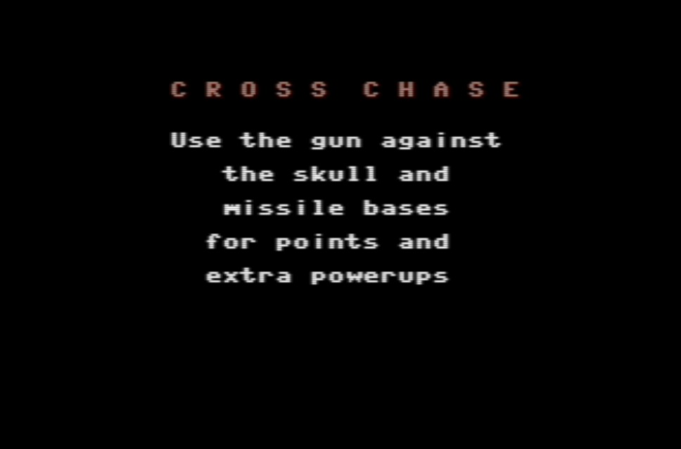

# CROSS CHASE
Cross Lib and Cross Chase

by Fabrizio Caruso (fabrizio_caruso@hotmail.com)

## THE GOAL

This is a personal project whose goal is the creation of:
1. the universal 8-bit abstraction layer "Cross Lib" for coding universal 8-games
2. the "universal" 8-bit game "Cross Chase" that has to be a fun and that should run
on (nearly) ALL 8 bit computers, consoles, handhelds and scientific calculators using the Motorola 6809, the MOS 6502, the Zilog Z80 and derivatives CPUs.
The game will be the proof of concept of how flexible the library is.

## THE TOOL-CHAIN

How is it this done?
This is achieved  by having "Cross Lib" provide APIs for the game code.
The game and library code are  separated: 
- the game code only depends on the APIs interface and 
- the APIs do not depend on the game code. Therefore it must be possible to re-use the same library for other games/programs.

The program is written in ANSI C and currently compiled with 
- CC65 for all 6502 targets (http://www.cc65.org/), 
- SCCZ80 (from Z88DK) for most Z80 targets (https://www.z88dk.org/), 
- ZSDCC (from Z88DK) for some Z80 targets (https://www.z88dk.org/),
- CMOC for most 6809 targets (https://perso.b2b2c.ca/~sarrazip/dev/cmoc.html),
- WinCMOC for some 6809 targets (https://sourceforge.net/projects/cmoc-win32/).

For other targets, GCC6809 for other 6809 targets, sdcc (proper or its CPCTelera version), as well as "GCC for TI" for the Texas TI99/4a are being taken into consideration. 

## THE GAME CODE

The game should be as portable as possible.
Therefore the following coding choices and design rules are applied:
1. ANSI C (for the game logic);
2. strictly separated input/output and hardware-dependent code from the game logic;
3. the prefered default graphics and input implementation is provided by conio.h (as implemented in CC65, Z88DK and WinCMOC), whenever no specialized code for a specific target is implemented;
4. joystick-related libraries as found in CC65 and in Z88DK;

Some target(s) may get specific graphic code with re-defined characters, software/hardware sprites and music/sound effects.

## SUPPORTED TARGETS 

(as of 2017/06/08)

### PC versions

There is a ncurses version that can be compiled for multiple platforms for which an ANSI C compiler and ncurses are available.
For example:
- cygwin (gcc + ncurses under cygwin/Windows) 
- windows 32/64 bit console (mingw + ncurses even under cywin/Windows with x86_64-w64-mingw32-gcc)

### 8-BIT versions

For most targets, more than one version is built, in order to support different hardware configuratins and expansions 
(e.g., memory expansions, second CPU, 80-col display card, etc.).

- abc80: ABC 80
- ace: Jupiter Ace
- apple2: Apple //
- apple2enh: Enhanced Apple //e
- aquarius: Mattel Aquarius 
- atari5200: Atari 5200
- atari: Atari 400/800
- atari_lynx: Atari Lynx
- c128_8502: Commodore 128 [8502 CPU; additionally Z80 versions are built]
- c128_z80: Commodore 128 [Z80 CPU; additionally 8502 versions are built]
- c16: Commodore 264 series (16/116/+4)
- c64: Commodore 64
- cbm510: Commodore CBM 510
- cbm610: Commodore CBM 610
- coco: Color Computer / Dragon 32/64
- cpc: Amstrad CPC
- cpm: CP/M with adm3a/vt52/vt100 terminals
- creativision: VTech Creativision
- eg2k: EACA EG2000
- einstein: Tatung Einstein
- gal: Galaksija
- gamate: Gamate
- kc: Robotron KC-85/2/3/4
- lambda: Lambda 8300
- m5: Sord M5
- mc1000: CCE MC-1000
- microbee: Microobee
- msx: MSX
- mtx: MTX 512
- nascom: Nascom
- nc100: Amstrad NC-100
- nes: Nintendo Enterteinment System
- oric: Tangerine Oric 1/Atmos
- osic1p: Ohio Scientific Challenger 1P
- p2000: Philips P2000
- pc6001: NEC PC 6001
- pce: PCEngine
- pet: Commodore Pet
- pps: Peters Plus Sprinter
- pv2000: Casio PV2000
- px4: Epson PX-4/HC-40
- px8: Epson PX-8/HC-80
- samcoupe: Sam Coupe
- sc3000: Sega SC 3000
- sharp_mz: Sharp MZ
- spectrum: Sinclair Spectrum 16k/48k/12k
- srr: Exidy Sorcerer
- supervision: Watara Supervision
- svi: Spectravideo 318/328
- ti82: Texas TI 82
- ti83: Texas TI 83
- ti85: Texas TI 85
- trs80: TRS-80 Model I/III/IV
- vg5k: VG-5000
- vic20: Commodore Vic 20
- vz200: VTech VZ200
- x1: Sharp X1
- z1013: Robotron Z1013
- z9001: Robotron Z9001
- zx80: Sinclair ZX80
- zx81: Sinclair ZX81

-------------------------------------------

## THE FUTURE

It should be possible to write more universal games using "Cross Lib".

The future main features of "Cross Lib":
- better separation and dependences with the game 
- better support multi-target input/output

## ADAPTIVE GRAPHICS

The tool-chain will produce a game with simple black and white ASCII graphics and no sound if none of these is available. 
If colors, graphics and sounds are available the tool-chain will produce a game with some simple sound eggects and with some possibly colored graphics.

## LICENCE

This software is provided 'as-is', without any express or implied warranty.
In no event will the authors be held liable for any damages arising from
the use of this software.

Permission is granted to anyone to use this software for non-commercial applications, 
subject to the following restrictions:

1. The origin of this software must not be misrepresented; you must not
claim that you wrote the original software. If you use this software in
a product, an acknowledgment in the product documentation would be
appreciated but is not required.

2. Altered source versions must be plainly marked as such, and must not
be misrepresented as being the original software.

3. This notice may not be removed or altered from any source distribution.

