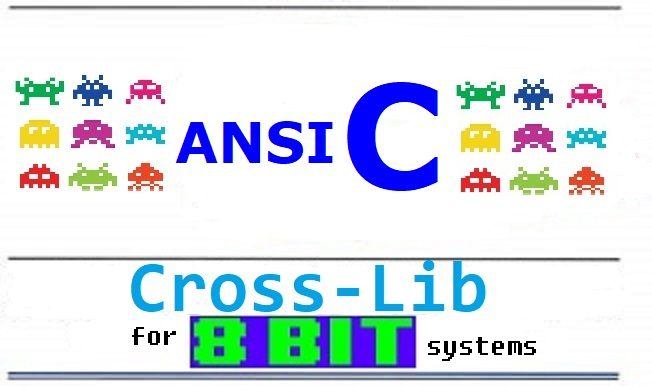

# CROSS LIB

*Cross-Lib* and games that use it (e.g., Cross Chase, Cross Shoot, Cross Bomber, Cross Snake, Cross Horde)

by Fabrizio Caruso (fabrizio_caruso@hotmail.com)

The universal *retro-hardware abstraction layer*.

-------------------------------------------

## THE GOAL

*Cross-Lib*, a *retro-hardware abstraction layer* for coding "universal" demos, games and programs for hundreds of mostly 8-bit systems (consoles, computers, scientific calculators, hand-held consoles, arcade boards, hacked toy computers, etc.). 

-------------------------------------------

## THE GAMES

These games are the proof of the flexibility of *Cross-Lib*.

Play the games online:
https://github.com/Fabrizio-Caruso/CROSS-LIB/blob/master/docs/GAMES.md

1. *Cross Chase* is compiled for and run
on (nearly) ALL 8-bit computers, game consoles, hand-held game consoles and scientific calculators. 
It can be parametrized in a way to make it run on systems with as little as 3k or 4k of available memory for the code.
It is somehow similar to *Gnome Robots*. The main difference is that it is a real-time game and that it has several items and power-ups to pick.
2. *Cross Shoot* requires more memory than "Cross Chase" but it should be equally universal as long as the required memory is available.
It is a shooter somehow similar to Robotron. It has many items and secrets to discover.
3. *Cross Bomber* is a mini-game and clone of Air Attack (aka Blitz). So it requires much less memory than "Cross Chase".
Its code is almost entirely in a single file. It uses pre-shifted tiles to produce smoother movements on graphics-enabled targets.
4. *Cross Snake* is similar in size to *Cross Chase* and can be run on an unexpanded Commodore 16 or a Commodore Vic 20 with +8k memory expansion.
It a my personal re-interpretation of Nibbler (arcade game) to which I have added more game elements. It has 50 secrets and several items to discover.
5. *Cross Horde* is similar in size to *Cross Chase* and can be run on an unexpanded Commodore 16 or a Commodore Vic 20 with +8k memory expansion.
It is a zombie shooter with several different enemies, levels, power-ups and special items to pick.

-------------------------------------------

## CURRENTLY SUPPORTED ARCHITECTURES

A partial list of the supported systems with their status is in: 
https://github.com/Fabrizio-Caruso/CROSS-LIB/blob/master/docs/STATUS.md

The main goal is to get the library and game to work on most vintage systems with possibly all 8-bit architectures as well as some 16 and 32-bit architectures.

The most significant supported CPU architecture are described below.

### 8-BIT ARCHITECTURES
- COSMAC RCA 1802 and derivates
- Intel 8080 and derivatives
- MOS 6502 and derivatives
- Motorola 6809 and derivatives
- Motorola 6803
- Zilog 80 and derivatives

### 16-BIT ARCHITECTURES
- Intel 8088/8086 
- Motorola 68000/68008
- PDP11
- TMS 9900
- Zilog Z8000

### 32-BIT ARCHITECTURES
- PowerPC
- Intel 386
- Motorola 68020
- MIPS32r2 (little-endian)

### 32/64-BIT ARCHITECTURE
We also support any current architecture for which GCC can produce a working binary.

-------------------------------------------

## SUPPORTED SYSTEMS AND THEIR STATUS

For most vintage systems (more than 200 different systems and sub-systems), you can build a version of the game with some graphics, sounds and real time input.
In principle you can compile the game in turn-based mode with minimal input and output (*stdlib*) for any architecture for which there is an ANSI C capable compiler.
You can also compile the game in action mode with minimal input and output for any architecture for which there an ANCI C compiler with *ncurses* or *conio* libraries.

For a complete list of the supported systems and their status look at:
https://github.com/Fabrizio-Caruso/CROSS-LIB/blob/master/docs/STATUS.md

-------------------------------------------

## THE TOOL-CHAIN

How is it this done?
This is achieved  by having "Cross Lib" provide APIs for the game code.
The game and library code are  separated: 
- the game code only depends on the APIs interface and 
- the APIs do not depend on the game code. Therefore it must be possible to re-use the same library for other games/programs.

The tool-chain currently supports: *CC65*, *Z88DK* (*SCCZ80* and *ZSDCC*), *CMOC*, *LCC1802*, *ACK*, *XTC68*, *GCC*, *GCC-Z8K*, *GCC-ATARI-ST*, *GCC-AMIGA*, *GCC-TI*.

For more details look at: 
https://github.com/Fabrizio-Caruso/CROSS-LIB/blob/master/docs/COMPILERS.md

-------------------------------------------

## HOW TO COMPILE GAMES AND TESTS

In order to compile the game you need:
- a POSIX environment (e.g., Windows+Cygwin, Linux)
- `make`
- `python` (2.x or 3.x)

I recommend also `gcc` and `ncurses` so that natives builds are possible.

For more details on the prerequisites we refer to: 
https://github.com/Fabrizio-Caruso/CROSS-LIB/blob/master/docs/PREREQUISITES.md

In order to build a game or a test, you need to be in the `src` directory.
You  build a project (either a game or a test) for a specific system by either using the `build_xl.py` script or an equivalent `make` command. 

### Using `build_xl.py`

I recommend that you use `build_xl.py` as follows:

`./build_xl [game_or_test_name] [optional system_name]`

Examples:
- `./build_xl.py snake` -> It builds Cross Snake for the native console by using `gcc` and `ncurses`.
- `./build_xl.py chase` -> It builds Cross Chase for the native console by using `gcc` and `ncurses`.
- `./build_xl.py bomber atari` -> It builds Cross Bomber for the Atari 8-bit target (by using the appropriate cross-compiler, i.e., CC65)
- `./build_xl.py snake vic20` -> It builds Cross Snake for the Commodore Vic 20.
- `./build_xl.py games msx` -> It builds all game projects for the MSX target (by using the appropriate cross-compiler, i.e., the ones in Z88DK).

### Using `make`

Using a standard `make` comamnd is possible but you will get fewer options.

For game projects you can use:

`make [system_name] -f ./games/[game_name]/Makefile.[game_name]`

For test projects you can use:

`make [system_name] -f ./tests/[test_name]/Makefile.[test_name]`

Examples for games:
- `make vic20 -f ./games/horde/Makefile.horde` builds *Cross Horde* for the Commodore Vic 20.
- `make nes -f ./games/shoot/Makefile.shoot` builds *Cross Shoot* for the Nintendo NES videogame console.
- `make spectrum -f ./games/bomber/Makefile.bomber` builds *Cross Bomber* for the Sinclair ZX Spectrum.
- `make ti83 -f ./games/chase/Makefile.chase` builds *Cross Chase* for the Texas Instrument TI 83 scientific calculator.
- `make ncurses -f ./games/chase/Makefile.chase` builds *Cross Chase* for all targets by using GCC for the native host console (e.g., CYGWIN, Linux, etc. console).
- `make cc65_targets ./games/chase/Makefile.chase` builds *Cross Chase* for all targets that are built with the CC65 cross-compiler for the MOS 6502-based systems.
- `make cmoc_targets ./games/chase/Makefile.chase` builds *Cross Chase* for all targets that are built with the CMOC cross-compiler for the Motorola 6809-based systems.
- `make z88dk_targets ./games/chase/Makefile.chase` builds *Cross Chase* for all targets that are built with the SCCZ80 and ZSDCC cross-compilers of the Z88DK dev-kit for Zilog 80-based and Intel 8080-based systems.

Examples for tests:
- `make vic20 -f ./tests/tiles/Makefile.tiles` builds the test `tiles` for the Commodore Vic 20.
- `make cpc -f ./tests/sounds/Makefile.sounds` builds the test `sounds` for the Amstrad CPC computer.
- `make atari -f ./tests/invaders/Makefile.invaders` builds the tests `invaders` for the Atari 8-bit computer.

For more details on build instructions look at:
https://github.com/Fabrizio-Caruso/CROSS-LIB/blob/master/docs/BUILD.md

-------------------------------------------
## CROSS-LIB APIs

The currently available APIs are described at
https://github.com/Fabrizio-Caruso/CROSS-LIB/blob/master/docs/CROSS_LIB_APIS.md

-------------------------------------------

## LOADING THE GAMES
In order to run the game you will have to follow a different procedure depending on whether you want to load it into an emulated system or a real system.

### Loading the game into an emulated vintage system
In most cases loading an executable into an emulator is straightforward. 
For a detailed guide on how to load the game on several emulated systems for which the procedure is not obvious, we refer to: 
https://github.com/Fabrizio-Caruso/CROSS-LIB/blob/master/docs/HOW_TO_LOAD_THE_GAME.md

### Loading the game into a real vintage system
This depends on the systems and the format used to store the game. For some hints on this take a look at:
https://github.com/Fabrizio-Caruso/CROSS-LIB/blob/master/docs/HOW_TO_LOAD_THE_GAME_ON_REAL_HARDWARE.md

-------------------------------------------

## THE GAME CODE

The game code is *hardware-agnostic* and has to be as portable as possible.
Therefore the following coding choices and design decisions have been made:
1. ANSI C (for the game logic);
2. strictly separated input/output and hardware-dependent code (in Cross-Lib) from the game logic;
3. input for keyboard/joystick and output for sound and display are provided by Cross-Lib

Some target(s) may get specific graphic code with re-defined characters, software/hardware sprites and music/sound effects but the game code is hardware-agnostic.

The code of the games is in:
https://github.com/Fabrizio-Caruso/CROSS-LIB/tree/master/src/games

The code of some tests is in:
https://github.com/Fabrizio-Caruso/CROSS-LIB/tree/master/src/demos

-------------------------------------------

## THE FUTURE

The main future goals are
- improving the exposed APIs 
- supporting more cross-compilers, native compilers, systems and sub-targets
- adding more features to Cross-Lib (e.g., more redefinable tiles, more sound effects, etc.)
- coding more universal games and demos

-------------------------------------------

## ADAPTIVE GRAPHICS

The tool-chain and Cross-Lib will produce a game with simple black and white ASCII graphics and no sound if none of these is available. 
If colors, graphics and sounds are available the tool-chain and Cross-Lib will produce a game with some simple sound effects and with some possibly colored graphics.

For example for the game Cross Snake you can see how it is rendered on the MSX and on the Game Boy:

For more snapshots we refer to: 
https://github.com/Fabrizio-Caruso/CROSS-LIB/blob/master/docs/SNAPSHOTS.md

-------------------------------------------

## CROSSLIB
Cross-Lib provides a *retro-hardware abstraction layer* for display, sound, input, etc.

Cross-Lib code is in: 
https://github.com/Fabrizio-Caruso/CROSS-LIB/tree/master/src/cross_lib

### Sound
Sound abstraction is achieved by providing common APIs for the (few) sounds that Cross-Lib provides.

### Input
Input abstraction is also achieved by common APIs that support either keyboard and/or joystick input for each possible target.

### Display
Display abstraction is provided by (at least) two levels of abstraction:
- Common APIs that, for each target, implement one of several graphics modes;
- Generic graphics modes that may be shared among a few targets.

For more details on Cross-Lib we refer to: 
https://github.com/Fabrizio-Caruso/CROSS-LIB/blob/master/docs/CROSSLIB.md

-------------------------------------------

## ACKNOWLEDGEMENTS

Cross-Lib would not exist without the cross-compilers and the support of their developers and the support of some people who have helped me handle the input/output of some targets.

A partial list of the people who have helped in found in: https://github.com/Fabrizio-Caruso/CROSS-LIB/blob/master/docs/CREDITS.txt

-------------------------------------------

## LICENCE

This software is provided 'as-is', without any express or implied warranty.
In no event will the authors be held liable for any damages arising from
the use of this software.

Permission is granted to anyone to use this software for non-commercial applications, 
subject to the following restrictions:

1. The origin of this software must not be misrepresented; you must not
claim that you wrote the original software. If you use this software in
a product, an acknowledgment in the product documentation would be
appreciated but is not required.

2. Altered source versions must be plainly marked as such, and must not
be misrepresented as being the original software.

3. This notice may not be removed or altered from any source distribution.

