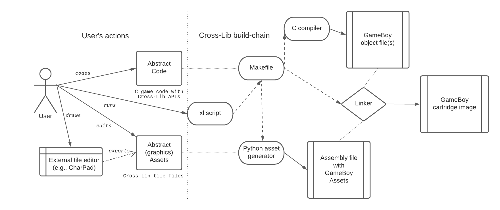

The `xl` script will trigger the full build process which will produce the target specific version of the project 
or massively build the same project for several targets (or even build several projects for one or more targets).
For example for the build of a project for the sole GameBoy target we may represent 
the interactions of various Cross-Lib components with this diagram:

