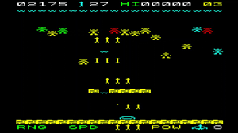
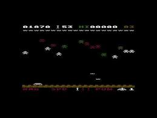
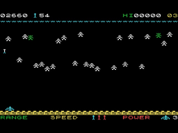
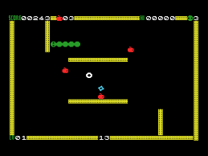
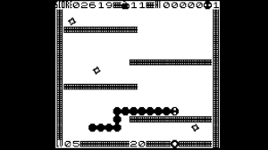
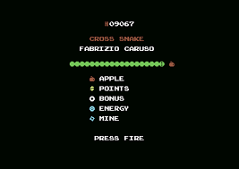
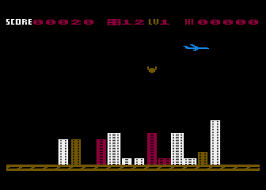
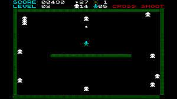
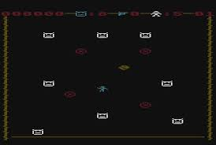

# THE GAMES

-------------------------------------------
## TREX

CONTROLS: either SPACE or FIRE.

1. Commodore Vic 20: 
https://nippur72.github.io/vic20-emu/?joy=1&load=http://github.com/Fabrizio-Caruso/CROSS-LIB/releases/download/trexBETA/Xtrex_vic20_exp_16k.prg

2. TI99/4A:
https://js99er.net/#/?cartUrl=https:%2F%2Fgithub.com%2FFabrizio-Caruso%2FCROSS-LIB%2Freleases%2Fdownload%2Fti99_1.32%2FXtrexti.bin

3. MSX:
https://webmsx.org/?cartridge1_url=http://github.com/Fabrizio-Caruso/CROSS-LIB/releases/download/trexBETA/Xtrex_msx_16k.rom

4. Video Technology Laser 500: 
https://nippur72.github.io/laser500emu/?load=http://github.com/Fabrizio-Caruso/CROSS-LIB/releases/download/trexBETA/Xtrex_laser500_keyboard.bin

-------------------------------------------
## STINGER

CONTROLS: either the joystick or J (move lefte),  L(move right), SPACE (check word)

1. Commodore Vic 20: 
https://nippur72.github.io/vic20-emu/?joy=1&load=http://github.com/Fabrizio-Caruso/CROSS-LIB/releases/download/stinger/Xstinger_vic20_exp_16k.prg

2. TI99/4A:
https://js99er.net/#/?cartUrl=https:%2F%2Fgithub.com%2FFabrizio-Caruso%2FCROSS-LIB%2Freleases%2Fdownload%2Fti99_1.32%2FXstingerti.bin

3. MSX:
https://webmsx.org/?cartridge1_url=http://github.com/Fabrizio-Caruso/CROSS-LIB/releases/download/stinger/Xstinger_msx_16k.rom

4. Video Technology Laser 500: 
https://nippur72.github.io/laser500emu/?load=http://github.com/Fabrizio-Caruso/CROSS-LIB/releases/download/stinger/Xstinger_laser500.bin

-------------------------------------------
## SHURIKEN

CONTROLS: either the joystick or I (up rotate),  J (move left/left rotate), K (down rotate), L(move right, right rotate), SPACE (check word)

1. Commodore Vic 20: 
https://nippur72.github.io/vic20-emu/?joy=1&load=http://github.com/Fabrizio-Caruso/CROSS-LIB/releases/download/shuriken/Xshuriken_vic20_exp_16k.prg

2. TI99/4A:
https://js99er.net/#/?cartUrl=https:%2F%2Fgithub.com%2FFabrizio-Caruso%2FCROSS-LIB%2Freleases%2Fdownload%2Fti99_1.32%2FXshurikenti.bin

3. MSX:
https://webmsx.org/?cartridge1_url=http://github.com/Fabrizio-Caruso/CROSS-LIB/releases/download/shuriken/Xshuriken_msx_16k.rom

4. Video Technology Laser 500: 
https://nippur72.github.io/laser500emu/?load=http://github.com/Fabrizio-Caruso/CROSS-LIB/releases/download/shuriken/Xshuriken_laser500.bin

-------------------------------------------
## VERBIX

Cross Verbix is a word game somehow similar to Scrabble and to a much lesser extent similar to Tetris: you must construct correct English words by rotating columns of letters or by rotating the bottom row before the letters reach the top level.
You can get extra points if you complete the level earlier by lowering the stack of letters below the second row.

CONTROLS: either the joystick or I (up rotate),  J (move left/left rotate), K (down rotate), L(move right, right rotate), SPACE (check word)

1. Commodore Vic 20: 
https://nippur72.github.io/vic20-emu/?joy=1&load=http://github.com/Fabrizio-Caruso/CROSS-LIB/releases/download/verbix/Xverbix_vic20_exp_16k.prg

2. TI99/4A:
https://js99er.net/#/?cartUrl=https:%2F%2Fgithub.com%2FFabrizio-Caruso%2FCROSS-LIB%2Freleases%2Fdownload%2Fti99_1.32%2FXverbixti.bin

3. MSX:
https://webmsx.org/?cartridge1_url=http://github.com/Fabrizio-Caruso/CROSS-LIB/releases/download/verbix/Xverbix_msx_16k.rom

4. Video Technology Laser 500: 
https://nippur72.github.io/laser500emu/?load=http://github.com/Fabrizio-Caruso/CROSS-LIB/releases/download/verbix/Xverbix_laser500.bin

5. Video Technology Laser 200 / VZ200: 
https://nippur72.github.io/laser310-emu/?load=http://github.com/Fabrizio-Caruso/CROSS-LIB/releases/download/verbix/Xverbix_vz200_24k.vz

## HORDE

Cross Horde is a zombie shooter with several different enemies, levels and power-ups and items to pick.

You die if a zombie reaches the wall behind the bow or if a zombie hits you with its bullets.

In order to improve your fire power you can pick up the rings that are dropped when some zombies die.
Rings will improve in this order:
- the range of your bow
- the speed of your bow
- the number of arrows thrown at once 
- the power of your bow
After these improvements, the rings will be necessary to unblock special items and to achieve the temporary "hyper" power.

CONTROLS: either the joystick or J (left), L (right), SPACE (fire).

1. Commodore Vic 20: 
https://nippur72.github.io/vic20-emu/?joy=1&load=http://github.com/Fabrizio-Caruso/CROSS-LIB/releases/download/XHorde1.0/Xhorde_vic20_exp_8k.prg

2. TI99/4A:
https://js99er.net/#/?cartUrl=https:%2F%2Fgithub.com%2FFabrizio-Caruso%2FCROSS-LIB%2Freleases%2Fdownload%2Fti99_1.32%2FXhordeti.bin

3. Commodore 64: 
https://nippur72.github.io/c64-emu/?joy=3&load=http://github.com/Fabrizio-Caruso/CROSS-LIB/releases/download/XHorde1.0/Xhorde_c64.prg

4. MSX 1:
https://homebrew.file-hunter.com/index.php?id=crosshorde

5. Sinclair ZX Spectrum 48K: \
https://spectrumcomputing.co.uk/playonline.php?eml=2&downid=140691 or https://spectrumcomputing.co.uk/playonline.php?eml=1&downid=140691

6. Video Technology Laser 200 / VZ200: 
https://nippur72.github.io/laser310-emu/?load=http://github.com/Fabrizio-Caruso/CROSS-LIB/releases/download/XHorde1.0/Xhorde_vz200_24k.vz

7. Video Technology Laser 500: 
https://nippur72.github.io/laser500emu/?load=http://github.com/Fabrizio-Caruso/CROSS-LIB/releases/download/XHorde1.0/Xhorde_laser500.bin

8. Commodore 264 series (C16/C116/C+4):
https://plus4world.powweb.com/play/cross_horde

Binaries are in the release section (Click on Assets): \
https://github.com/Fabrizio-Caruso/CROSS-LIB/releases/tag/XHorde1.0

-------------------------------------------

## SNAKE

This my own re-interpretation of Nibbler (arcade) and Snake (primarily a cell phone game), to which I have added many more game elements.

You have to go through 32 levels (with 16 different maps) + an optional secret level (with its own map).
To complete a level you have to eat all the apples while:
- avoiding your own tail and body
- avoiding the fixed and bouncing mines
- avoiding to starve by losing your energy (eat apples to prevent this).
As you starve, the snake moves faster and faster.

Walls do not kill you and let you pause the game and think about your next move.

You can also catch special items that will help in your quest:
- ring (collect 3 or even 4 for extra points and to spawn more special items such as "freeze")
- freeze (special item that freezes the mines and restores your energy
- $ (extra points... but also some secret effects if you collect many)
- extra life (special and hard to unlock item that gives 1 extra life)

CONTROLS: either the joystick or I J K L to move and SPACE to start/continue.

You can play the game online:

1. Commodore Vic 20: \
https://nippur72.github.io/vic20-emu/?joy=1&load=http://github.com/Fabrizio-Caruso/CROSS-LIB/releases/download/XSnake2.0/Xsnake_vic20_exp_16k.prg

2. TI99/4A:
https://js99er.net/#/?cartUrl=https:%2F%2Fgithub.com%2FFabrizio-Caruso%2FCROSS-LIB%2Freleases%2Fdownload%2Fti99_1.32%2FXsnaketi.bin

3. Commodore 64: \
https://nippur72.github.io/c64-emu/?joy=3&load=http://github.com/Fabrizio-Caruso/CROSS-LIB/releases/download/XSnake2.0/Xsnake_c64.prg

4. MSX 1: \
https://homebrew.file-hunter.com/index.php?id=crosssnake

5. Sinclair ZX Spectrum 48K: \
https://spectrumcomputing.co.uk/playonline.php?eml=2&downid=137608 or https://spectrumcomputing.co.uk/playonline.php?eml=1&downid=137608

6. Video Technology Laser 200 / VZ200: \
https://nippur72.github.io/laser310-emu/?load=http://github.com/Fabrizio-Caruso/CROSS-LIB/releases/download/XSnake2.0/Xsnake_vz200_24k.vz

7. Video Technology Laser 500: \
https://nippur72.github.io/laser500emu/?load=http://github.com/Fabrizio-Caruso/CROSS-LIB/releases/download/XSnake2.0/Xsnake_laser500.bin

8. Commodore 264 series (C16/C116/C+4): \
http://plus4world.powweb.com/play/cross_snake_2_0

Binaries are in the release section (Click on Assets): \
https://github.com/Fabrizio-Caruso/CROSS-LIB/releases/tag/XSnake2.0

-------------------------------------------

## BOMBER

 
The game's goal is to destroy all buildings so that you can land on an empty road.
The game is a clone of Air Attack (aka Blitz) game that was first developed on the Commodore Pet.
The game is controlled by the single fire button (first joystick button for targets with joystick input and space key for targets with keyboard input).
Your score depends on the number of building destroyed, the level reached and how fast you complete each single level.
The game has 9 levels and it ends after the eighth level.

CONTROLS: either the joystick fire button or SPACE.

You can play the game online:

1. Commodore Vic 20: \
https://nippur72.github.io/vic20-emu/?joy=1&load=http://github.com/Fabrizio-Caruso/CROSS-LIB/releases/download/XBomber/Xbomber_vic20_exp_8k.prg

2. TI99/4A:
https://js99er.net/#/?cartUrl=https:%2F%2Fgithub.com%2FFabrizio-Caruso%2FCROSS-LIB%2Freleases%2Fdownload%2Fti99_1.32%2FXbomberti.bin

3. Commodore 64: \
https://nippur72.github.io/c64-emu/?joy=3&load=http://github.com/Fabrizio-Caruso/CROSS-LIB/releases/download/XBomber/Xbomber_c64.prg

4. MSX 1: \
https://homebrew.file-hunter.com/index.php?id=crossbomber

5. Sinclair ZX Spectrum 48K: \
https://spectrumcomputing.co.uk/playonline.php?eml=2&downid=137605 or https://spectrumcomputing.co.uk/playonline.php?eml=1&downid=137605

6. Video technology Laser 200 / VZ200: \
https://nippur72.github.io/laser310-emu/?restore=false&?load=http://github.com/Fabrizio-Caruso/CROSS-LIB/releases/download/XBomber/Xbomber_vz200_24k.vz

7. Video technology Laser 500: \
https://nippur72.github.io/laser500emu/?restore=false&?load=http://github.com/Fabrizio-Caruso/CROSS-LIB/releases/download/bomber/Xbomber_laser500.bin

8. Commodore 264 series (C16/C116/C+4): \
http://plus4world.powweb.com/play/cross_bomber

Binaries are in the release section (Click on Assets): \
https://github.com/Fabrizio-Caruso/CROSS-LIB/releases/tag/XBomber

-------------------------------------------

## SHOOT 

The game's goal is to kill all common enemies or kill all 4 "skulls". 
Common enemies can be killed quickly if pushed against the walls by shooting at them.
The "skulls" and the boss cannot be pushed and are harder to kill.
You have to avoid all enemies, rockets and chasing missiles.
All flashing items have positive effects and can grant you special powers. 
Your bullets have a limited power that can be improved by catching the special fire power item. 
You can also fetch the mine item that grants you 3 powerful mines to use against all your enemies.
Discover the 12 items. Some items are secret. In total the game has 16 secrets.
You can unlock the 16 secrets by shooting at the skulls and at the missile and rocket bases in different ways.
The game has 16 different levels including 2 boss levels + 1 secret level.

CONTROLS: either the joystick or I J K L to move and SPACE to fire.

You can play the gamne online:

1. Commodore VIC 20: \
https://nippur72.github.io/vic20-emu/?joy=1&load=http://github.com/Fabrizio-Caruso/CROSS-LIB/releases/download/XShootRebuild/XShoot_vic20_exp_16k.prg

2. TI99/4A:
https://js99er.net/#/?cartUrl=https:%2F%2Fgithub.com%2FFabrizio-Caruso%2FCROSS-LIB%2Freleases%2Fdownload%2Fti99_1.32%2FXshootti.bin

3. Commodore 64: \
https://nippur72.github.io/c64-emu/?joy=3&load=http://github.com/Fabrizio-Caruso/CROSS-LIB/releases/download/XShootRebuild/Xshoot_c64.prg 

4. MSX 1: \
https://homebrew.file-hunter.com/index.php?id=crossshoot

5. Sinclair ZX Spectrum 48K: \
https://spectrumcomputing.co.uk/playonline.php?eml=2&downid=137606 or https://spectrumcomputing.co.uk/playonline.php?eml=1&downid=137606

6. Video Technology Laser 200 / VZ 200: \
https://nippur72.github.io/laser310-emu/?restore=false&load=http://github.com/Fabrizio-Caruso/CROSS-LIB/releases/download/XShootRebuild/Xshoot_vz200_24k.vz

7. Video Technology Laser 500: \
https://nippur72.github.io/laser500emu/?restore=false&load=http://github.com/Fabrizio-Caruso/CROSS-LIB/releases/download/XShootRebuild/Xshoot_laser500.bin

8. Commodore 264 series (C16/C116/C+4): \
http://plus4world.powweb.com/play/cross_shoot

Binaries are in the release section (Click on Assets): \
https://github.com/Fabrizio-Caruso/CROSS-LIB/releases/tag/XShootRebuild

-------------------------------------------

## CHASE 

The game's goal is to lure the "ghosts" into the mines and possibly kill the "skull" by repeatedly using the gun.
You have to avoid all enemies, the mines, all walls, rockets and chasing missiles.
All flashing items have positive effects and can grant you some special powers. Discover the 10 items.
If you use the gun against the skull and/or the missiles and rockets, you can unlock some special secret items.
There are 20 different levels including 4 boss levels.

CONTROLS: either the joystick or I J K L (to move) and SPACE to fire.

You can play the game online for different systems:

1. Commodore Vic 20: \
https://nippur72.github.io/vic20-emu/?joy=1&load=http://github.com/Fabrizio-Caruso/CROSS-LIB/releases/download/XChase/Xchase_vic20_exp_16k.prg

2. TI99/4A:
https://js99er.net/#/?cartUrl=https:%2F%2Fgithub.com%2FFabrizio-Caruso%2FCROSS-LIB%2Freleases%2Fdownload%2Fti99_1.32%2FXchaseti.bin

3. Commodore 64: \
https://nippur72.github.io/c64-emu/?joy=3&load=http://github.com/Fabrizio-Caruso/CROSS-LIB/releases/download/XChase/Xchase_c64.prg

4. MSX 1: \
https://homebrew.file-hunter.com/index.php?id=crosschase

5. Sinclair ZX Spectrum 48K: \
https://spectrumcomputing.co.uk/playonline.php?eml=2&downid=112056 or https://spectrumcomputing.co.uk/playonline.php?eml=1&downid=112056

6. Video Technology Laser 210 / VZ200 : \
https://nippur72.github.io/laser310-emu/?restore=false&load=http://github.com/Fabrizio-Caruso/CROSS-LIB/releases/download/XChase/Xchase_vz200_18k.vz

7. Video Technology Laser 500: \
https://nippur72.github.io/laser500emu/?restore=false&load=http://github.com/Fabrizio-Caruso/CROSS-LIB/releases/download/XChase/Xchase_laser500.bin

8. Commodore 264 series (C16/C116/C+4): \
http://plus4world.powweb.com/play/cross_chase_32k_v0_9

Binaries are in the release section (Click on Assets): \
https://github.com/Fabrizio-Caruso/CROSS-LIB/releases/tag/XChase

 
